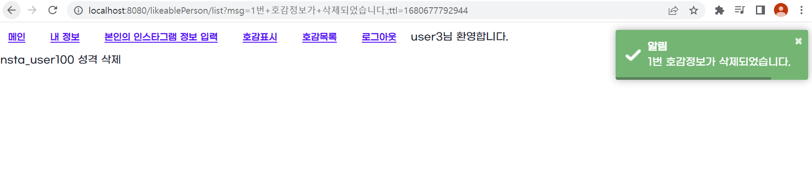
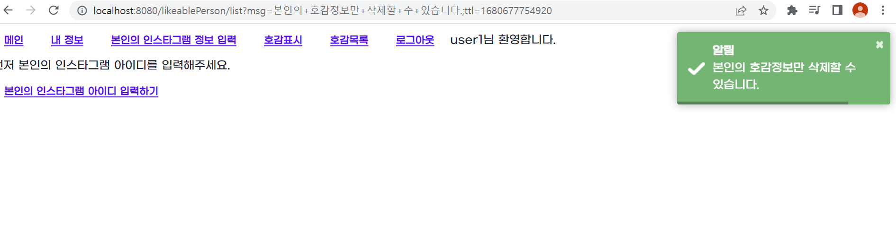

# 1Week_정윤성.md

## Title: [1Week] 정윤성

### 미션 요구사항 분석 & 체크리스트

---

- [ ]  호감정보 삭제 기능
    - [ ]  테스트코드 작성
    - [ ]  Controller에서 /delete/{id} get요청을 받을시 처리
    - [ ]  Service에서 delete메소드 구현
- [ ]  다른사람은 삭제 못하게 변경
    - [ ]  테스트코드 작성
    - [ ]  다른사람은 삭제 못하게 변경
- [ ]  구글 로그인

### N주차 미션 요약

---

**[접근 방법]**

## 호감 정보 삭제

- [ ]  테스트코드 작성

```java
//LikeablePersonControllerTests

@Test
@DisplayName("호감표시 삭제")
@WithUserDetails("user3")
void t006() throws Exception{
    //When
    ResultActions resultActions = mvc
            .perform(get("/likeablePerson/delete/1"))
            .andDo(print());

    //Then
    resultActions
            .andExpect(handler().handlerType(LikeablePersonController.class))
            .andExpect(handler().methodName("delete"))
            .andExpect(status().is3xxRedirection())
            .andExpect(redirectedUrlPattern("/likeablePerson/list**"));
}
```

delete 메소드로 삭제를 하고, 다시 호감목록 페이지로 돌아오는지 테스트하는 코드를 작성하였다.

- [ ]  Controller에서 /delete/{id} get요청을 받을시 처리

```java
//LikeablePersonController.java

@GetMapping("/delete/{id}")
public String delete(@PathVariable("id")Long likablePersonId){
    RsData<LikeablePerson> createRsData = 
						likeablePersonService.delete(likablePersonId);

    return rq.redirectWithMsg("/likeablePerson/list", createRsData);
}
```

 likeablePersonService.delete(likablePersonId) 메소드로 RsData를 만든다.

rq를 통해 성공, 삭제 resultCode와 메시지를 전달한다.

- [ ]  서비스에서 delete메소드 구현

```java
//LikeablePersonService.java

@Transactional
public RsData<LikeablePerson> delete(Long likeablePersonId){
    Optional<LikeablePerson> deleteData = likeablePersonRepository.findById(Math.toIntExact(likeablePersonId));

    if(deleteData.isEmpty()){
        return RsData.of("F-1", "삭제하려는 호감정보가 없습니다.");
    }

    likeablePersonRepository.delete(deleteData.get());
    return RsData.of("S-1", "%s번 호감정보가 삭제되었습니다.".formatted(likeablePersonId));
}
```

findById 메소드로 LikeablePersonId의 정보를 데이터베이스에서 가져온다.

만약 비어있다면 실패 코드를 반환한다.

그렇지 않다면, 삭제하고 성공 RsData를 반환한다.

## 다른사람은 삭제 못하게 변경

- 삭제를 처리하기 전에 해당 항목에 대한 소유권이 본인(로그인한 사람)에게 있는지 체크
- [ ]  테스트코드 작성

```java
@Test
@DisplayName("다른 유저가 호감표시 삭제")
@WithUserDetails("user1")
void t007() throws Exception{
    //When
    ResultActions resultActions = mvc
            .perform(get("/likeablePerson/delete/1"))
            .andDo(print());

    //Then
    resultActions
            .andExpect(handler().handlerType(LikeablePersonController.class))
            .andExpect(handler().methodName("delete"))
            .andExpect(status().is3xxRedirection())
            .andExpect(redirectedUrlPattern("/likeablePerson/list?msg=%EB%B3%B8%EC%9D%B8%EC%9D%98+%ED%98%B8%EA%B0%90%EC%A0%95%EB%B3%B4%EB%A7%8C+%EC%82%AD%EC%A0%9C%ED%95%A0+%EC%88%98+%EC%9E%88%EC%8A%B5%EB%8B%88%EB%8B%A4.**"));
}
```

테스트 코드를 어떻게 작성해야할지 계속 고민했는데,

json을 반환하게 만들어서 오류코드를 확인하게끔 만드려고 했으나

어차피 url에 msg를 전달하기 때문에 이를 활용하기로 했다.

“본인의 호감정보만 삭제할 수 있습니다” 메시지가 url에 존재한다면 테스트코드가 성공하게 작성하였다.

그런데 content-language가 en이라 한글이 깨졌고, 깨진 텍스트를 테스트코드에 작성했다.

추후에 다른 더 좋은 방법이 있다면 활용하고 싶다.

- [ ]  다른사람은 삭제 못하게 변경

```java
//LikeablePersonController.java
@GetMapping("/delete/{id}")
public String delete(@PathVariable("id")Long likablePersonId){
    RsData<LikeablePerson> createRsData = likeablePersonService.delete(rq.getMember(), likablePersonId);

    return rq.redirectWithMsg("/likeablePerson/list", createRsData);
}
```

rq에서 멤버를 가져온다. 그리고 delete 메소드의 인자로 넘겨준다.

```java
//LikeablePersonService.java

@Transactional
public RsData<LikeablePerson> delete(Member member, Long likeablePersonId){
    Optional<LikeablePerson> deleteData = likeablePersonRepository.findById(Math.toIntExact(likeablePersonId));

    if(member==null){
        return RsData.of("F-1", "먼저 로그인 하세요");
    }

    if(deleteData.isEmpty()){
        return RsData.of("F-2", "삭제하려는 호감정보가 없습니다.");
    }
    else if(deleteData.get().getFromInstaMember().equals(member.getInstaMember())){
        likeablePersonRepository.delete(deleteData.get());
        return RsData.of("S-1", "%s번 호감정보가 삭제되었습니다.".formatted(likeablePersonId));
    }

    return RsData.of("F-3", "본인의 호감정보만 삭제할 수 있습니다.");
}
```

Member, findById로 찾은 LikeablePerson이 null일 때를 각각 “F- “ 로 처리해준다.

deleteData의 InstaMember와 Member의 InstaMember가 같은지 확인한다.

같다면 삭제하고 성공 RsData를 반환한다.

그렇지 않다면, 다른 사람이 삭제하려는 것이므로 실패 “F-3” RsData를 반환한다.

### 결과화면

user3가 1번 호감정보 삭제



user1이 1번 호감정보 삭제



## 구글 로그인

application.yml

```yaml
security:
    oauth2:
      client:
        registration:
          google:
            client-name: Google
            client-id: 416946277743-25n2evpol7k0lmhofhst510vdched4na.apps.googleusercontent.com
            client-secret:
            redirect-uri: http://localhost:8080/login/oauth2/code/google
            authorization-grant-type: authorization_code
            scope:
              - email
              - profile
```

먼저 GCP에서 googleAPI를 발급받아 client id와 secret을 만들었다.

이미 카카오로그인이 OAuth2로 구현되어 있어서 application.yml 파일에 추가만 해주었다.

**[특이사항]**

## 아쉬웠던 점/궁금했던 점

1. 테스트 코드 작성
    1. 테스트 코드 작성 시 컨트롤러와 서비스를 분리하여 작성하여야 하는지?
        1. 서비스 단에서 처리하는 일들 테스트 추가
    2. MockMVC로 테스트를 하는데, 만약 view나 status말고 다른 부분으로 파악해야 한다면?
    3. 구글 로그인은 어떻게 테스트 해야 하는지 잘 모르겠다.
    
2. 구글 로그인
    1. 카카오 로그인은  Client-ID에 키만 입력해주어도 동작하였다.
    2. 구글 로그인은 id와 secret 둘 다 입력해주어야 했다. 그 이유는?

## Refactoring

1. 다른 사람이 삭제시 toastr가 초록색 알림 창이다. 경고 창으로 변경.
2. Service에서 delete메소드의 예외처리
    1. 인자로 받은 Member의 InstaMember와 deleteData의 InstaMember가 같다면 “S-1”을 리턴
    2. 따라서, 예외처리와 성공 처리 후 남은 마지막 리턴값은 “F-3”이다. 만약 다른 예외가 있어도 지금은 다 F-3로 처리된다.
    3. 이 구조를 좀 더 깔끔하게 바꿀 수 있다면 리팩토링.

---

## 1주차 미션 마무리
1. JpaRepository PK가 Integer였던 걸 Long으로 수정
2. DeleteMapping으로 변경 및 @PreAuthroized 추가
3. Service 로직에서 최종 리턴을 성공값으로 가독성 좋게 변경
4. historyBack으로 잘못된 요청시 4xx로 반환